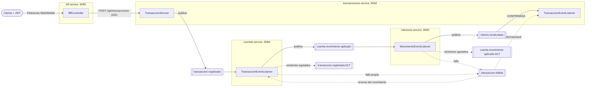

# Arquitectura de eventos — Banco XYZ

## 1. Patrón elegido

**Event-Driven Choreography (Saga coreografiada) sobre Apache Kafka**, con Dead Letter Topics y compensación.

| Decisión | Elegido | Alternativa descartada | Motivo |
|---|---|---|---|
| Broker | Kafka | JMS (ActiveMQ) | Log persistente y reproducible, particiones por `cuentaId` (orden por cuenta), consumer groups para escalar, reentrega por offset |
| Coordinación | Coreografía | Orquestación (saga orquestada) | Sin servicio central: cada microservicio reacciona a eventos y mantiene su BD propia (*database per service*) |
| Entrega | At-least-once + consumidor idempotente | Exactly-once transaccional | Más simple; la deduplicación por `eventId` (tabla `evento_procesado`) evita duplicados |

Los endpoints GET síncronos con Feign + Resilience4j se conservan (consultas). Los eventos cubren las **escrituras** que atraviesan servicios.

## 2. Diagrama



## 3. Tópicos y eventos

Todos con 3 particiones, clave = `cuentaId` (garantiza orden por cuenta), valor JSON. Contratos en `common-lib` (`com.bancoxyz.common.events`).

| Tópico | Evento | Productor | Consumidor | Efecto |
|---|---|---|---|---|
| `transaccion.registrada` | `TransaccionRegistradaEvent` | transacciones | cuentas | Crea `CuentaAnual` (credito→deposito, debito→retiro) |
| `cuenta.movimiento-aplicado` | `MovimientoAplicadoEvent` | cuentas | intereses | Ajusta `Interes.saldo` |
| `interes.recalculado` | `InteresRecalculadoEvent` | intereses | transacciones | Transacción `CONFIRMADA` |
| `transaccion.fallida` | `TransaccionFallidaEvent` | cuentas / intereses | transacciones, cuentas | `RECHAZADA` + reverso del movimiento (si el fallo fue en intereses) |
| `*.DLT` | mensaje original | error handler | (operación manual) | Mensajes que agotaron reintentos |

Estados de `Transaccion`: `PENDIENTE_PUBLICACION` → `PENDIENTE` → `CONFIRMADA` | `RECHAZADA`.

## 4. Tolerancia a fallos

- **Publicador (Resilience4j)**: `@CircuitBreaker` + `@Retry` (instancia `kafkaPublisher`, en `config-repo/<servicio>.yml`). Con Kafka caído, transacciones-service activa el fallback y deja la transacción en `PENDIENTE_PUBLICACION`; un `@Scheduled` (outbox simple) la republica al recuperarse el broker. En cuentas/intereses el publicador no tiene fallback: la excepción revierte la transacción de BD del listener y Kafka reentrega.
- **Consumidor**: `DefaultErrorHandler` con backoff exponencial (3 reintentos, 0.5 s ×2), luego `DeadLetterPublishingRecoverer` → `<tópico>.DLT` y publicación de `transaccion.fallida` (`common-lib/.../KafkaErrorHandling`).
- **Idempotencia**: cada listener guarda el `eventId` en `evento_procesado` dentro de la misma transacción que aplica el cambio.
- **Compensación**: si intereses falla (p. ej. cuenta inexistente) tras aplicar cuentas su movimiento, cuentas inserta un asiento inverso y transacciones marca `RECHAZADA`.

## 5. Cómo probar

```bash
docker compose up -d                                   # Kafka :9092, Kafka UI :8090
mvn -q clean install -DskipTests
# arrancar en orden: config-server, discovery-server, auth-service, cuentas/intereses/transacciones

TOKEN=$(curl -s -X POST localhost:8081/auth/login -H 'Content-Type: application/json' \
  -d '{"username":"user","password":"user123"}' | jq -r .token)

# flujo feliz (usar un cuentaId existente en intereses.csv)
curl -s -X POST localhost:8082/api/transacciones -H "Authorization: Bearer $TOKEN" \
  -H 'Content-Type: application/json' -d '{"cuentaId":137,"monto":500,"tipo":"credito"}'
curl -s localhost:8082/api/transacciones/<id> -H "Authorization: Bearer $TOKEN"   # estado CONFIRMADA

# flujo de fallo: cuentaId inexistente en intereses -> reintentos -> DLT -> RECHAZADA + reverso
curl -s -X POST localhost:8082/api/transacciones -H "Authorization: Bearer $TOKEN" \
  -H 'Content-Type: application/json' -d '{"cuentaId":99999,"monto":100,"tipo":"debito"}'

# Kafka caído: docker compose stop kafka -> POST => estado PENDIENTE_PUBLICACION;
# docker compose start kafka -> pasa a PENDIENTE y luego CONFIRMADA. Ver /actuator/circuitbreakers
```
